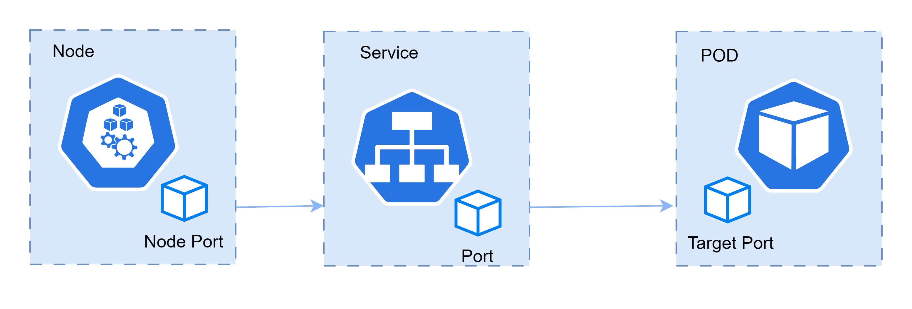
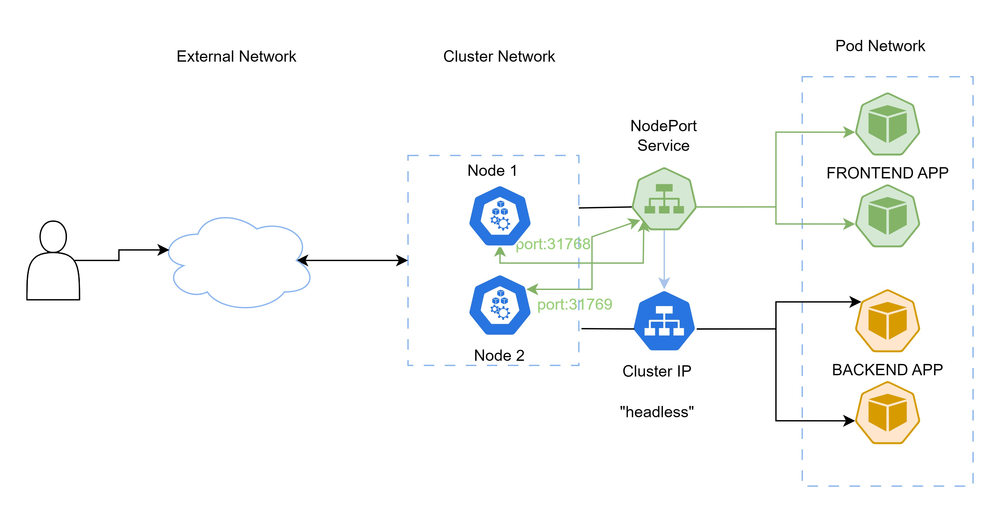
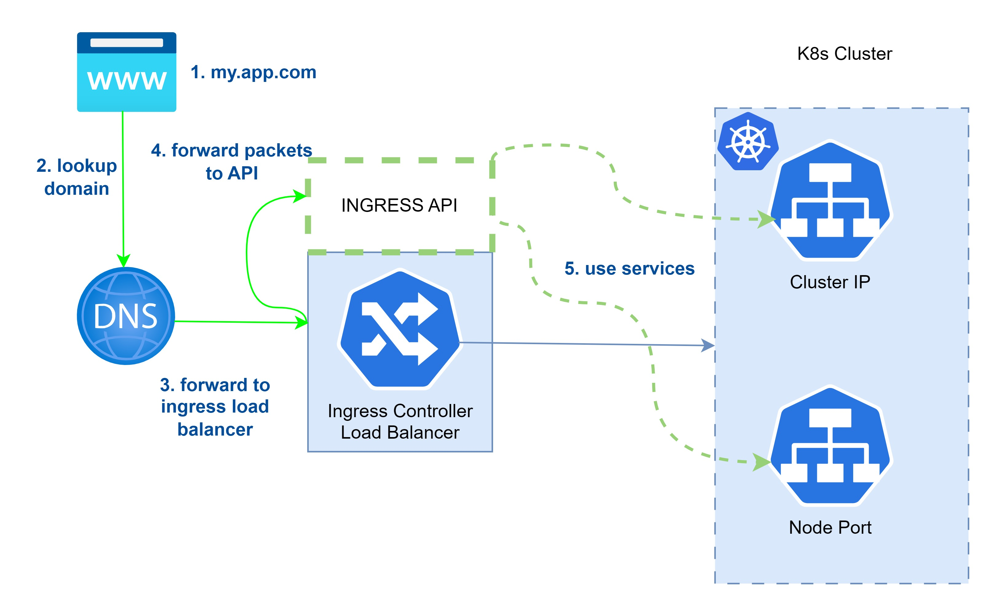

# Understanding Networking in Kubernetes

## Overview of Networking in Kubernetes
- Networking in Kubernetes revolves around communication between Pods.
- Pods are instances of applications that need to interact within and outside the cluster.

## Three Key Networks in Kubernetes
1. **Pod Network**: An internal network connecting all Pods within the cluster.
2. **Cluster Network**: Also internal, allows access to the outside world, like nodes.
3. **Node Network**: External network through which users access the cluster.

## Pod Communication in a Cluster
- Example scenario: Front-end (Pods 1, 2, 3) and Back-end (Pods 4, 5, 6) applications.
- Each Pod has its own IP address within the Pod network (e.g., 10.10.0.1).
- Applications running in Pods within the same network can communicate.

## Cluster Network for External Access
- Cluster network provides access to external entities like nodes.
- Nodes (e.g., node1, node2, node3) are part of this network.
- Nodes are connected to the internal cluster network.

## Introducing Services for Load Balancing
- Services act as an API-based internal Kubernetes load balancer.
- Services allow load balancing incoming requests to Pods they expose.
- Two important service types for CKAD: ClusterIP and NodePort.

## ClusterIP and NodePort Services
- **ClusterIP**: Service accessible only on the cluster network.
- **NodePort**: Exposes high ports on nodes to forward traffic to services.
- NodePorts are essentially port forwarders to the NodePort service type.

## Importance of Ingress Resource
- Although valid, users shouldn't access applications via NodePorts.
- The Ingress resource is used to manage external access to services.
- In the next lesson, Ingress will be discussed in detail.

## NodePort and ClusterIP Use Cases
- NodePort: Useful for exposing services on node high ports (e.g., 32000).
- ClusterIP: Ideal for connecting front-end and back-end services securely.
- ClusterIP ensures communication between Pods without external exposure.

## Conclusion
- Kubernetes networking revolves around the communication between Pods.
- Pods within the same network can interact.
- Cluster network provides access to nodes and external resources.
- Services, including ClusterIP and NodePort, manage load balancing.
- Ingress resources enable controlled external access to services.

## Introduction to Kubernetes Services

- **Kubernetes Service vs. systemd Service:**
  - Kubernetes service ≠ Linux systemd service.
  - A Kubernetes service exposes applications in the network.

- **Purpose of Kubernetes Service:**
  - A Kubernetes service exposes a logical set of pods to the network.
  - Implements round-robin load balancing for traffic distribution.

## How Services Work

- **Selector and Labels:**
  - Pods targeted by a service are determined by a selector (label).
  - Selector ensures specific pods are included in the service.

- **kube-controller-manager:**
  - A Kubernetes process running on the controller node.
  - Scans for pods matching the selector.
  - Adds these pods as endpoints to the service.
  - Updates endpoints when pods are added or removed.

- **Decoupling and Independence:**
  - Services exist independently from the applications they expose.
  - Deletion of a deployment doesn't delete the associated service.
  - Services are maintained by kube-controller-manager based on selectors.

## Role of kube-proxy

- **kube-proxy:**
  - Agent running on nodes.
  - Watches Kubernetes API for services and endpoints.
  - Opens random ports for traffic to service ports.
  - Redirects traffic to specified pod endpoints.

- **Automatic and Background Operation:**
  - kube-proxy functions without explicit configuration.

## Different Service Types

- **ClusterIP:**
  - Default service type.
  - Exposes service on an internal cluster IP.
  - Not accessible by external users.

- **NodePort:**
  - Adds port forwarding.
  - Allocates a high-level port dynamically on the host running the application.
  - External users access the allocated port, which forwards traffic to the service.

- **LoadBalancer:**
  - Implemented in public cloud environments.
  - Automatically provisions an external load balancer.

- **ExternalName:**
  - Works with DNS names for DNS-level redirection.
  - Useful for migration scenarios.

### Creating Kubernetes Services

- **kubectl expose and kubectl create service:**
  - Use `kubectl expose` or `kubectl create service` to create services.
  - Exposes access to Deployments, ReplicaSets, Pods, or other services.
  - Mainly used to expose Deployments and their associated Pods.

- **Port Specification:**
  - Use the `--port` argument to specify the port the service should use.
  - Required when creating services.

### Understanding Port Types in Services

- **TargetPort:**
  - The port on the application/container that the service addresses.
  - Specifies the application's listening port (e.g., 8080 for a web server).

- **Port:**
  - The port on which the service itself is available.
  - Same as or different from the target port.
  - Service is running on its dedicated IP address.

- **NodePort:**
  - Port exposed externally with the NodePort service type.
  - Dynamically generated (e.g., around 32000).



### Demonstration Steps

1. **Create a Deployment:**
   - `kubectl create deploy nginxsvc --image=nginx`

2. **Scale the Deployment:**
   - `kubectl scale deploy nginxsvc --replicas=3`

3. **Expose the Deployment:**
   - `kubectl expose deploy nginxsvc --port=80`

4. **View Service Details:**
   - `kubectl get all`

5. **View Endpoints:**
   - `kubectl describe svc nginxsvc`

6. **Change Service Type to NodePort:**
   - `kubectl edit svc nginxsvc`
   - Set `type` to `NodePort`
   - Configure port details

7. **Access Service Externally:**
   - Use `curl http://$(minikube ip):32000`

```
$ kubectl create deploy nginxsvc --image=nginx
$ kubectl scale deploy nginxsvc --replicas=3
$ kubectl expose deploy nginxsvc -h | less
$ kubectl expose deploy nginxsvc --port=80
service/nginxsvc exposed
$ kubectl get all
...
NAME                 TYPE        CLUSTER-IP     EXTERNAL-IP   PORT(S)   AGE
service/kubernetes   ClusterIP   10.96.0.1      <none>        443/TCP   28m
service/nginxsvc     ClusterIP   10.101.21.61   <none>        80/TCP    51s

$ kubectl describe svc nginxsvc
Name:              nginxsvc
Namespace:         default
Labels:            app=nginxsvc
Annotations:       <none>
Selector:          app=nginxsvc
Type:              ClusterIP
IP Family Policy:  SingleStack
IP Families:       IPv4
IP:                10.101.21.61
IPs:               10.101.21.61
Port:              <unset>  80/TCP
TargetPort:        80/TCP
Endpoints:         10.244.0.129:80,10.244.0.130:80,10.244.0.131:80
Session Affinity:  None
Events:            <none>

$ kubectl get svc nginxsvc -o yaml

$ kubectl get endpoints
NAME         ENDPOINTS                                         AGE
kubernetes   192.168.49.2:8443                                 32m
nginxsvc     10.244.0.129:80,10.244.0.130:80,10.244.0.131:80   4m43s

$ kubectl get svc
NAME         TYPE        CLUSTER-IP     EXTERNAL-IP   PORT(S)   AGE
kubernetes   ClusterIP   10.96.0.1      <none>        443/TCP   33m
nginxsvc     ClusterIP   10.101.21.61   <none>        80/TCP    5m27s

$ minikube ssh
docker@minikube:~$ curl http://10.101.21.61
<!DOCTYPE html>
....

$ kubectl edit svc nginxsvc
$ kubectl get svc
$ curl http://$(minikube ip):3200
```

### Understanding Microservices and Service Types

### Microservices Architecture

Microservices architecture separates front-end and back-end components into individual pods for flexibility and scalability.

Example: Front-end (WordPress), Back-end (Database).

### Service Types for Microservices

- **Backend (Database) Service:** Utilizes the `clusterIP` type for internal-only access within the cluster.
- **Frontend (Web Servers, WordPress) Service:** Employs the `NodePort` type for external access.

### Visualizing Service Types in Microservices



### Exploring the Benefits of Different Service Types

### NodePort for Frontend

- Frontend services are exposed for external user access.
- A dynamically-generated high-level port is allocated on cluster nodes.
- External users can access the application using the NodePort.

### ClusterIP for Backend

- Backend services remain internal-only.
- Accessible solely within the cluster.
- Ensures security for sensitive services like databases.

### Conclusion and the Role of Ingress

While services effectively facilitate access to microservices, the concept of "Ingress" further enhances user accessibility to applications within a microservices environment. 

## Services and DNS in Kubernetes

### CoreDNS: Kubernetes Internal DNS Server

- **Name:** CoreDNS
- **Namespace:** kube-system
- **Function:** Acts as the internal DNS server for Kubernetes.

### Service Registration with CoreDNS

- When a Service is created, it automatically registers with CoreDNS.
- This registration ensures that Services are accessible by name within the cluster.
- CoreDNS manages the dynamic ports assigned to Services, making name resolution reliable.

### DNS Resolution for Pods

- Pods in the Kubernetes cluster automatically use CoreDNS as their DNS resolver.
- CoreDNS facilitates seamless name resolution for Services and other resources.

### Demonstrating Service and DNS Interaction
    kubectl run test-pod --image=busybox --command -- sleep 3600
    kubectl get svc
    kubectl get svc,pods -n kube-system
    kubectl exec -it test-pod -- cat /etc/resolv.conf
    kubectl exec -it test-pod -- nslookup nginxsvc

### Constructing Service Names with DNS
- Service names are constructed based on the namespace and name of the Service.
- Format: service-name.namespace.svc.cluster.local
- Example: nginxsvc.default.svc.cluster.local
- Seamless Service Access via DNS
- Services can be accessed seamlessly from Pods using their registered names.
- DNS resolution allows direct communication between Pods and Services without 
  additional configuration.

The integration of Kubernetes Services with the CoreDNS internal DNS system enhances the cluster's networking capabilities. Services are effortlessly accessible via DNS, contributing to a more cohesive and efficient communication model within the Kubernetes environment.

```
$ kubectl run testpod --image=busybox -- sleep 3600

$ kubectl get svc,pods -n kube-system

$ kubectl exec -it testpod -- cat /etc/resolv.conf
nameserver 10.96.0.10
search default.svc.cluster.local svc.cluster.local cluster.local
options ndots:5

$ kubectl get svc
NAME         TYPE        CLUSTER-IP       EXTERNAL-IP   PORT(S)   AGE
kubernetes   ClusterIP   10.96.0.1        <none>        443/TCP   116m
nginxsvc     ClusterIP   10.105.177.172   <none>        80/TCP    5m1s

$ kubectl exec -it testpod -- nslookup nginxsvc
Server:         10.96.0.10
Address:        10.96.0.10:53

Name:   nginxsvc.default.svc.cluster.local
Address: 10.105.177.172
```

## Network Policies in Kubernetes

- **Purpose:** Network policies allow you to control inbound and outbound network traffic to and from Pods.
- **Restrictions:** By default, Kubernetes does not impose network traffic restrictions.
- **Network Plugin Requirement:** Network policies require support from the network plugin.
  - Calico plugin supports network policies.
  - Weave plugin does not support network policies.

### Applying Network Policies

- **Enforcement:** Network policies are enforced based on the network plugin's capabilities.
- **Traffic Denial:** If a network policy applies but no match is found, traffic will be denied.
- **Default Configuration:** In the absence of network policies, all traffic is allowed.

### Network Policy Identifiers

- **Pod:** `podSelector` in the network policy targets pods based on labels.
- **Namespace:** `namespaceSelector` grants access to specific namespaces.
- **IP Blocks:** `ipBlock` specifies IP ranges, but doesn't affect node-to-pod traffic.

### Defining Network Policies

- Selector labels are vital for defining which traffic is allowed.
- Network policies do not conflict; they are additive.

### Network Policy Demo

Let's walk through a network policy example:

1. **Network Policy YAML:** The example defines a network policy with a `podSelector` based on the label `app: nginx`.
2. **Ingress Rule:** Ingress allows incoming traffic only from pods with the label `access: true`.
3. **Pod Definitions:** Nginx and Busybox pods are defined with appropriate labels.

3. **Apply Network Policy:** Use `kubectl apply -f nwpolicy_complete_example.yaml`.

4. **Expose Nginx Pod:** Expose the Nginx pod with `kubectl expose pod nginx --port=80`.

5. **Inspect Network Policy:** Describe the network policy with `kubectl describe networkpolicy`.

6. **Test Connectivity:** Use `kubectl exec -it busybox -- wget --spider --timeout=1 nginx` to test connectivity.
   - This command is expected to fail due to network policy restrictions.

7. **Adjusting Labels:** Use `kubectl label pod busybox access=true` to adjust labels.

8. **Retest Connectivity:** Repeat the previous test command to observe successful connectivity.
   - This demonstrates the impact of network policy enforcement.

## Note on Network Plugins

- Network policy behavior depends on the network plugin and its configuration.
- The Calico network plugin is known to provide reliable network policy support.
- Variability may arise with different plugins and platforms.

### Conclusion

Network policies play a crucial role in managing network traffic within Kubernetes clusters. They enable precise control over communication between pods, enhancing security and isolation by restricting traffic flow as needed.


```
$ kubectl apply -f nwpolicy-complete-example.yaml
networkpolicy.networking.k8s.io/access-nginx created
pod/nginx created
pod/busybox created

$ kubectl expose pod nginx --port=80

$ kubectl describe networkpolicy
Name:         access-nginx
Namespace:    default
Created on:   xxxxxx
Labels:       <none>
Annotations:  <none>
Spec:
  PodSelector:     app=nginx
  Allowing ingress traffic:
    To Port: <any> (traffic allowed to all ports)
    From:
      PodSelector: access=true
  Not affecting egress traffic
  Policy Types: Ingress

$ kubectl exec -it busybox -- wget --spider --timeout=1 nginx
Connecting to nginx (10.109.118.17:80)
remote file exists

$ kubectl label pod busybox access=true
pod/busybox labeled
```

```
$ kubectl create deploy lesson8lab --image=nginx --replicas=3

$ kubectl get deploy
NAME         READY   UP-TO-DATE   AVAILABLE   AGE
lesson8lab   3/3     3            3           3m41s

$ kubectl expose deploy lesson8lab --port=80

$ kubectl get all --selector app=lesson8lab

$ kubectl get endpoints

$ kubectl get all --selector app=lesson8lab -o wide

$ minikube ssh

$ kubectl edit svc lesson8lab
-- add nodePort:32000 and change network to NodePort from ClusertIP

$ kubectl get svc
NAME         TYPE        CLUSTER-IP       EXTERNAL-IP   PORT(S)        AGE
lesson8lab   NodePort    10.98.214.236    <none>        80:32000/TCP   17m

$ curl $(minikube ip):32000
```

## Introduction to Ingress

- **Purpose:** Ingress provides a way to expose HTTP and HTTPS routes from outside the Kubernetes cluster to services within the cluster.
- **Ingress Controller:** Ingress relies on an Ingress controller, which acts as a load balancer, facilitating external access.
- **Load Balancer Choices:** Different Ingress controllers work with various load balancers, such as HAProxy, Nginx, and more.
- **Load Balancer Implementation:** The Ingress controller implements the load balancer both as a physical entity and as an API resource within Kubernetes.



### Ingress Flow

1. **User Request:** A user initiates a request to access an application, such as `myapp.com`.
2. **DNS Resolution:** DNS resolves the domain name to the Ingress load balancer's IP address.
3. **Ingress Controller:** The Ingress controller, acting as a load balancer, receives the request.
4. **API Interaction:** The Ingress controller connects to the Kubernetes API and routes traffic to the appropriate backend service.

### Key Aspects of Ingress

- **External Access:** Ingress enables external users to access applications within the cluster.
- **Load Balancer:** The Ingress controller acts as a load balancer, distributing traffic.
- **Two Phases:** Ingress functions as both a controller and an API resource within Kubernetes.
- **Routing Rules:** Traffic routing is controlled by rules defined in the Ingress resource.
- **DNS Configuration:** DNS must be configured to resolve to the Ingress load balancer's IP address.

### Ingress Capabilities

Ingress offers several capabilities for managing external access and traffic routing:

1. **Externally Reachable URLs:** Ingress provides URLs for external access, in coordination with DNS configuration.
2. **Load Balancing:** It distributes traffic among backend services.
3. **SSL/TLS Termination:** Ingress can terminate SSL/TLS encryption.
4. **Name-Based Virtual Hosting:** It allows routing based on domain names.

### Ingress Controllers

- **Essential Component:** Ingress controllers are vital for Ingress functionality.
- **Multiple Solutions:** Ingress controllers are provided by the Kubernetes community, offering multiple solutions.
- **Controller Options:** Some popular Ingress controllers include:
  - Nginx Ingress Controller
  - HAProxy Ingress Controller
  - Traefik Ingress Controller
  - Kong Ingress Controller
  - Contour Ingress Controller
  - Minikube Ingress Controller (for local setups)

### Conclusion

Ingress plays a crucial role in exposing Kubernetes cluster resources to external users. It leverages Ingress controllers to facilitate external access, routing traffic based on defined rules. By understanding Ingress and choosing an appropriate Ingress controller, you can effectively manage external access to your Kubernetes applications.

### Introduction to Ingress

- **Purpose:** Ingress provides a way to expose HTTP and HTTPS routes from outside the Kubernetes cluster to services within the cluster.
- **Ingress Controller:** Ingress relies on an Ingress controller, which acts as a load balancer, facilitating external access.
- **Load Balancer Choices:** Different Ingress controllers work with various load balancers, such as HAProxy, Nginx, and more.
- **Load Balancer Implementation:** The Ingress controller implements the load balancer both as a physical entity and as an API resource within Kubernetes.

### Ingress Flow

1. **User Request:** A user initiates a request to access an application, such as `myapp.com`.
2. **DNS Resolution:** DNS resolves the domain name to the Ingress load balancer's IP address.
3. **Ingress Controller:** The Ingress controller, acting as a load balancer, receives the request.
4. **API Interaction:** The Ingress controller connects to the Kubernetes API and routes traffic to the appropriate backend service.

### Key Aspects of Ingress

- **External Access:** Ingress enables external users to access applications within the cluster.
- **Load Balancer:** The Ingress controller acts as a load balancer, distributing traffic.
- **Two Phases:** Ingress functions as both a controller and an API resource within Kubernetes.
- **Routing Rules:** Traffic routing is controlled by rules defined in the Ingress resource.
- **DNS Configuration:** DNS must be configured to resolve to the Ingress load balancer's IP address.

### Ingress Capabilities

Ingress offers several capabilities for managing external access and traffic routing:

1. **Externally Reachable URLs:** Ingress provides URLs for external access, in coordination with DNS configuration.
2. **Load Balancing:** It distributes traffic among backend services.
3. **SSL/TLS Termination:** Ingress can terminate SSL/TLS encryption.
4. **Name-Based Virtual Hosting:** It allows routing based on domain names.

### Ingress Controllers

- **Essential Component:** Ingress controllers are vital for Ingress functionality.
- **Multiple Solutions:** Ingress controllers are provided by the Kubernetes community, offering multiple solutions.
- **Controller Options:** Some popular Ingress controllers include:
  - Nginx Ingress Controller
  - HAProxy Ingress Controller
  - Traefik Ingress Controller
  - Kong Ingress Controller
  - Contour Ingress Controller
  - Minikube Ingress Controller (for local setups)

### Conclusion

Ingress plays a crucial role in exposing Kubernetes cluster resources to external users. It leverages Ingress controllers to facilitate external access, routing traffic based on defined rules. By understanding Ingress and choosing an appropriate Ingress controller, you can effectively manage external access to your Kubernetes applications.

## Configuring Minikube Ingress Controller

- **Minikube Addons:** Minikube simplifies Ingress configuration using its addon system.
- **Addon for Ingress:** Minikube provides an addon called "ingress" to enable Ingress functionality.

### Enabling Minikube Ingress

1. **Check Available Addons:** Use the command `minikube addons list` to see available addons.
2. **Enable Ingress Addon:** Execute `minikube addons enable ingress` to enable the Ingress controller.

### Verifying Ingress Configuration

1. **Wait for Deployment:** The Ingress controller components will be deployed, including services and deployments.
2. **Verify Namespace:** Run `kubectl get namespaces` to confirm the new `ingress-nginx` namespace.
3. **Check Components:** Use `kubectl get all -n ingress-nginx` to list the components in the new namespace.

### Exploring Ingress Controller Components

- **Service:** The `ingress-controller` service handles external access to the Ingress controller.
- **Deployment:** The Ingress controller's deployment manages the pods responsible for Ingress operations.
- **Admission Job:** An admission job ensures proper access for the Ingress controller deployment.
- **Ingress Pods:** Pods within the deployment implement the Ingress functionality.

### Conclusion

Configuring the Minikube Ingress controller is straightforward, thanks to the provided addon system. By enabling the Ingress addon, you enable external access to your Kubernetes applications running in Minikube. This simplifies the process of working with Ingress for local development and testing purposes.

## Kubernetes Networking and Ingress - Hands-On Demos

### Microservices and Services

- Microservices Architecture:
  - Frontend and backend pods for applications.
  - Example: Frontend WordPress and backend database.
- Using Deployments for Frontend and Backend.
- Service Types in Microservices:
  - ClusterIP for internal backend.
  - NodePort for external frontend access.
- Microservices Environment Diagram.
- Headless Service for Backend Access.
- Ingress for Easier Application Access.

###  Services and DNS

- Kubernetes Internal DNS (coreDNS).
- Service Registration with Kubernetes DNS.
- Pods Using coreDNS as DNS Resolver.
- Accessing Services by Name from Pods.
- DNS Naming Convention for Services.
- NetworkPolicies and IP Blocks.
- NetworkPolicy Identifiers: Pod, Namespace, IP Block.
- Traffic to/from Node Always Allowed.
- Selector Labels in NetworkPolicies.
- NetworkPolicies Are Additive.

### Ingress Explained

- Ingress as Load Balancer and API Resource.
- Ingress Controllers and Load Balancers.
- Load Balancer Connection to Cluster Nodes.
- Ingress API Resource Connection to Services.
- Ingress Flow for Incoming Requests.
- Ingress for External Access to Kubernetes Resources.
- Ingress Load Balancer and Cluster Connection.
- Ingress Exposes HTTP and HTTPS Routes.
- Traffic Routing Controlled by Ingress Rules.
- Ingress Use Cases: External URLs, Load Balancing, SSL/TLS, Virtual Hosting.
- Ingress Controllers in Kubernetes Ecosystem.

### Configuring Minikube Ingress

- Using Minikube Addon for Ingress.
- Enabling Ingress Addon with Minikube.
- Minikube Addons List and Ingress Controller.
- Ingress Controller Namespace: ingress-nginx.

## Hands-On Ingress Configuration

1. **Verify Deployments:** `kubectl get deploy`
2. **Check Services:** `kubectl get svc`
3. **Access Service:** `curl http://<minikube-ip>:<NodePort>`
4. **Create Ingress:** `kubectl create ingress nginxsvc-ingress --rule=/=nginxsvc:80 --rule=/hello=newdep:8080`
5. **Describe Ingress:** `kubectl describe ingress nginxsvc-ingress`
6. **Edit `/etc/hosts`:** Add DNS resolution entry.
7. **Verify Ingress Address:** `kubectl get ingress`
8. **Access Ingress:** `curl http://nginxsvc.info`
9. **Access Custom Path:** `curl http://nginxsvc.info/hello`
10. **Create New Deployment:** `kubectl create deployment newdep --image=gcr.io/google-samples/hello-app:2.0`
11. **Expose New Deployment:** `kubectl expose deployment newdep --port=8080`
12. **Verify Custom Path:** `curl http://nginxsvc.info/hello`

```
$ kubectl get deploy
NAME         READY   UP-TO-DATE   AVAILABLE   AGE
lesson8lab   3/3     3            3           176m
nginxsvc     3/3     3            3           4h49m

$ kubectl get svc nginxsvc
NAME       TYPE        CLUSTER-IP       EXTERNAL-IP   PORT(S)   AGE
nginxsvc   ClusterIP   10.105.177.172   <none>        80/TCP    4h47m

$ curl http://$(minikube ip):32000

$ kubectl create ingress -h | less

$ kubectl create ingress nginxsvc-ingress --rule="/=nginxsvc:80" --rule="/hello=newdep:8080"
ingress.networking.k8s.io/nginxsvc-ingress created

$ minikube ip
192.168.49.2

$ sudo vim /etc/hosts
$ cat /etc/hosts
# [network]
# generateHosts = false
127.0.0.1       localhost
192.168.49.2    nginxsvc.info

$ kubectl get ingress
NAME               CLASS   HOSTS   ADDRESS        PORTS   AGE
nginxsvc-ingress   nginx   *       192.168.49.2   80      15m

$ curl nginxsvc.info

$ kubectl create deployment newdep --image=gcr.io/google-samples/hello-app:2.0

$ kubectl expose deployment newdep --port=8080

$ curl nginxsvc.info/hello
Hello, world!
Version: 2.0.0
Hostname: newdep-765c469569-hcvzn
```

## Ingress Rules Overview

Ingress Rules provide a powerful mechanism for directing incoming traffic to specific backend services based on various criteria. Understanding the components of Ingress Rules is crucial for effectively managing traffic in Kubernetes.

- **Components of Ingress Rules:**
  - **Host Field:** An optional field that allows you to specify a hostname for inbound HTTP traffic. If no host is specified, the rule applies to all inbound traffic.
  - **Paths:** A list of paths that you want to match against incoming requests. Paths are defined using POSIX regular expressions or simple strings.
  - **Backend:** Specifies the service or resource to which the traffic should be forwarded. This backend can be a Kubernetes Service or, in some cases, a cloud-based storage resource.
  - **Default Backend:** Used to handle traffic that doesn't match any specified path.

- **Backend Types:**
  - **Service Backend:** Connects to a Kubernetes Service. Traffic matching a path will be routed to the corresponding Service's endpoints.
  - **Resource Backend:** Used to refer to cloud-based object storage resources, allowing Ingress to provide access to storage resources through URLs. Note that this is not a primary focus in CKAD.

### Path Types

Paths in Ingress Rules can be matched using different types to achieve precise routing control.

- **Exact `PathType`:**
  - Requires an exact match for the specified path. No match occurs if a trailing slash is added to the requested path.

- **Prefix `PathType`:**
  - Matches if the requested path starts with the specified prefix. Both the path itself and the path with a trailing slash will match.

### Ingress Types and Rules

Different Ingress types and rules allow you to manage traffic routing based on specific criteria.

- **Single Service Backend Ingress:**
  - Suitable for scenarios with a single rule connecting a hostname or path to a single backend service.
  - Example: `kubectl create ingress single --rule="/files=filesservice:80"`

- **Simple Fanout Ingress:**
  - Involves multiple rules that direct different paths to distinct backend services.
  - Example: `kubectl create ingress single --rule=files --rule=db`

- **Name-Based Virtual Hosting Ingress:**
  - Routes requests based on the host header in the HTTP request.
  - Requires a DNS entry for each host header to work correctly.
  - Example: `kubectl create ingress multihost --rule=my.example.com/files=filesservice --rule=my.example.org/data=dataservice`

### Advanced Example: Multihost Ingress

Let's explore an advanced example demonstrating multihost Ingress with virtual hosting.

1. **Create Deployments:** 
   - `kubectl create deploy mars --image=nginx`
   - `kubectl create deploy saturn --image=httpd`

2. **Create Services:**
   - `kubectl expose deploy mars --port=80`
   - `kubectl expose deploy saturn --port=80`

3. **Configure `/etc/hosts`:**
   - Redirect `mars.example.com` and `saturn.example.com` to the Minikube IP (49.2).
   - Example: `sudo vim /etc/hosts`

4. **Create Multihost Ingress:**
   - `kubectl create ingress multihost --rule=mars.example.com/=mars:80 --rule=saturn.example.com/=saturn`

5. **Edit Ingress PathType:**
   - Change the PathType to `prefix` using `kubectl edit ingress multihost`.

6. **Verify Ingress:**
   - `curl saturn.example.com` (httpd default page)
   - `curl mars.example.com` (NGINX welcome page)

```
$ kubectl create deploy mars --image=nginx
$ kubectl create deploy saturn --image=httpd
$ kubectl expose deploy mars --port=80
$ kubectl expose deploy saturn --port=80
$ minikube ip

$ sudo nano /etc/hosts
# generateHosts = false
127.0.0.1       localhost
192.168.49.2    nginxsvc.info
192.168.49.2    mars.example.com
192.168.49.2    saturn.example.com

$ kubectl create ingress multihost --rule="mars.example.com/=mars:80" --rule="saturn.example.com/=saturn:80"
ingress.networking.k8s.io/multihost created

$ kubectl edit ingress multihost
# change to Prefix ==> pathType: Prefix

$ curl saturn.example.com
<html><body><h1>It works!</h1></body></html>

$ curl mars.example.com
```

## What is IngressClass?

- **IngressClass:** Introduced in Kubernetes 1.22, a resource that enhances the way Ingress controllers are managed in a cluster.

- **Purpose:** IngressClass allows you to set a specific Ingress controller as the cluster default. This default controller becomes the go-to choice for handling incoming traffic.

- **Advantage:** By designating an IngressClass as the default, the process of managing Ingress resources becomes more streamlined and user-friendly.

### Working with IngressClass

- **Ingress Resource Specification:** With IngressClass, each Ingress resource you define should include a `class` specification.

- **Referencing Cluster Default:** The specified `class` in an Ingress resource refers to the IngressClass that is designated as the cluster default. This eliminates the need to specify the Ingress controller for every Ingress resource.

- **Simplified Configuration:** IngressClass enhances the organization and management of Ingress resources by promoting the use of a default Ingress controller class.

### Benefits of Knowing About IngressClass

- **Visibility:** As you work with Kubernetes environments, you will likely encounter Ingress resources that utilize the `class` specification.

- **Easier Management:** Understanding IngressClass allows you to grasp the rationale behind specifying classes in Ingress resources. This knowledge contributes to better configuration practices.

## Conclusion

IngressClass is a valuable addition to Kubernetes that simplifies the management of Ingress controllers by allowing the designation of a cluster default. By knowing about IngressClass, you're better prepared to work with Ingress resources that incorporate the `class` specification.

## Ingress Initial Problem Identification

- **Scenario:** The initial problem is that accessing `nginxsvc.info` via `curl` results in a "Service Temporarily Unavailable" error (503 response) from Nginx.

- **Observations:** The error suggests that the Ingress might be functioning, but something within the service chain is causing the issue.

### Investigating Ingress and Ingress Controller

- **Check Ingress Status:** Run `kubectl get Ingress` to verify if the Ingress is resolving any host to the Minikube IP address (`192.168.49.2`).

- **Ingress Controller Status:** Confirm that the Ingress controller is operational using `kubectl get all -n ingress-nginx`. The presence of the Ingress controller indicates that Ingress processing is occurring.

- **Description Check:** Examine the detailed information of the Ingress using `kubectl describe Ingress nginxsvc-ingress`. Ensure that the path is resolving to the expected service (`nginxsvc:80`).

### Service Endpoint Inspection

- **Service Endpoint Issue:** If the Ingress seems fine but the error persists, focus on the service itself.

- **Service Information:** Use `kubectl describe service nginxsvc` to view the service details.

- **Endpoints Absence:** If the service has no endpoints, it indicates that there's a problem with the service connecting to the backend.

- **Selector Check:** Inspect the selector label for the service. Incorrect labels might lead to missing endpoints.

- **Check Pod Labels:** Use `kubectl get pods --show-labels` to verify the labels on the pods and match them with the service selector.

### Resolving the Issue

- **Edit Service Selector:** If a mismatch in labels is found, correct it using `kubectl edit svc nginxsvc`.

- **Endpoint Check:** After fixing the selector label, run `kubectl get endpoints` to ensure the service now has associated backends.

- **Retry Curl Command:** Once the service endpoints are established, retry the `curl` command on `nginxsvc.info`.

### Troubleshooting Checklist

1. Verify the Ingress controller's presence.
2. Ensure correct name resolving setup.
3. Check the service selector label matches the pod labels.
4. Inspect service details and endpoints.

Troubleshooting Ingress involves a systematic process of checking Ingress, Ingress controller, service, and selector labels. By following these steps, you can identify issues and resolve them, ensuring smooth Ingress functionality.

```
$ kubectl get ingress
NAME               CLASS   HOSTS                                 ADDRESS        PORTS   AGE
multihost          nginx   mars.example.com,saturn.example.com   192.168.49.2   80      44m
nginxsvc-ingress   nginx   *                                     192.168.49.2   80      99m

$ kubectl describe ingress nginxsvc-ingress
Name:             nginxsvc-ingress
Labels:           <none>
Namespace:        default
Address:          192.168.49.2
Ingress Class:    nginx
Default backend:  <default>
Rules:
  Host        Path  Backends
  ----        ----  --------
  *
              /        nginxsvc:80 (10.244.0.136:80,10.244.0.137:80,10.244.0.138:80)
              /hello   newdep:8080 (10.244.0.147:8080)
Annotations:  <none>
Events:       <none>

$ cat /etc/hosts
$ kubectl get ns
$ kubectl get all -n ingress-nginx
$ kubectl describe service nginxsvc
$ kubectl get pods --show-labels
$ kubectl edit svc nginxsvc
$ kubectl get endpoints
```

```
$ kubectl create deploy lesson9lab --image=nginx
$ kubectl expose deploy lesson9lab --port=80
$ kubectl create ingress lesson9lab --rule="lesson9lab.example.com/=lesson9lab:80"

$ sudo nano /etc/hosts
192.168.49.2    lesson9lab.example.com

$ kubectl get ingress
NAME               CLASS   HOSTS                                 ADDRESS        PORTS   AGE
lesson9lab         nginx   lesson9lab.example.com                192.168.49.2   80      3m21s

$ kubectl edit ingress
# Make path type to prefix    pathType: Prefix

$ curl http://lesson9lab.example.com

$ kubectl get ingress
$ kubectl describe ingress lesson9lab
$ kubectl get ns
$ minikube addons list
$ minikube addons enable ingress
$ curl http://lesson9lab.example.com
```